### Financial Valuation in C
#### Data analysis on Financial Statements :dollar:
Financial Statement analysis in C language of a given company
- Income statement & Balance Sheet analysis

The numerical analysis run in C can calculate financial ratios, run statistical analysis to perform valuations of small business or even a company listed on the stock exchange.

In finance, valuation is the process of determining the present value of an asset. Valuations can be done on assets or on liabilities.

Valuation guide
- Fundamental Analysis <a id="2">[1]</a>
- Ratio calculations <a id="2">[2]</a>
- Valuation
- Output

## Estructura
Here we can see the flow structure of the program. 

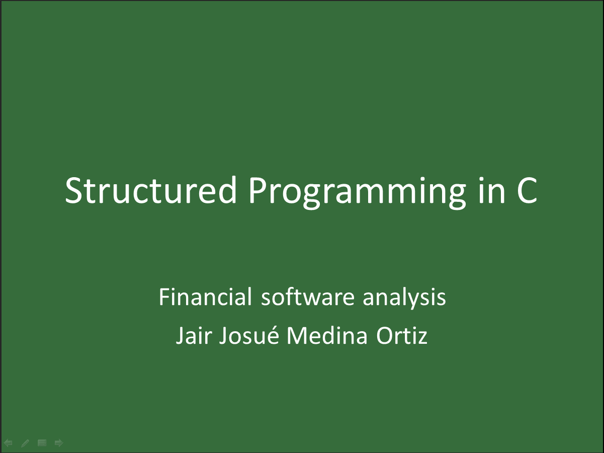
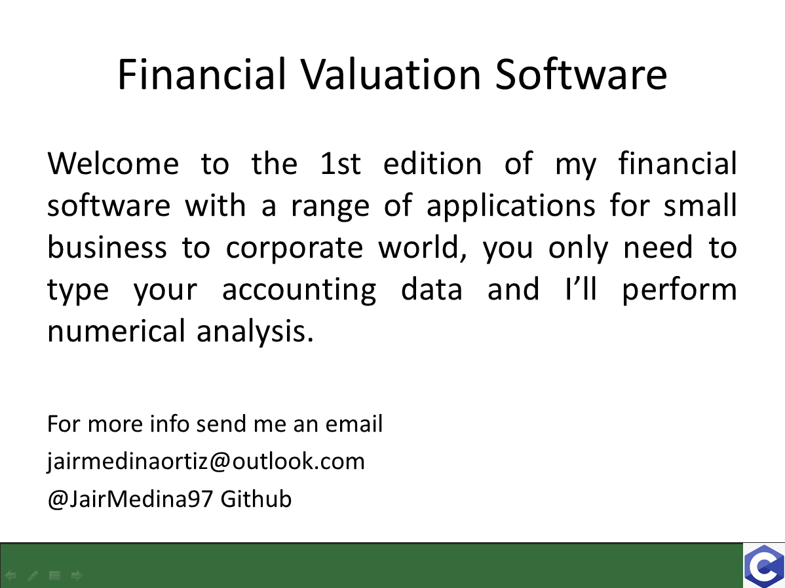
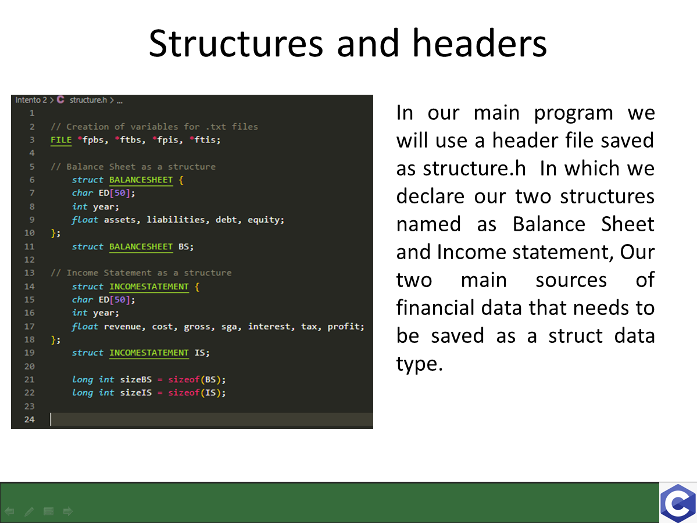
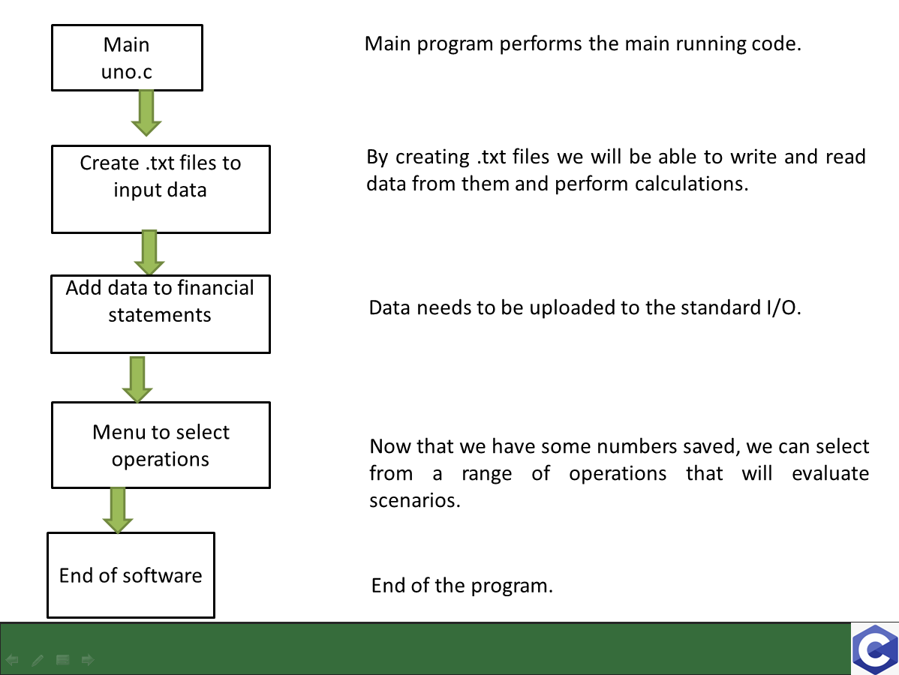
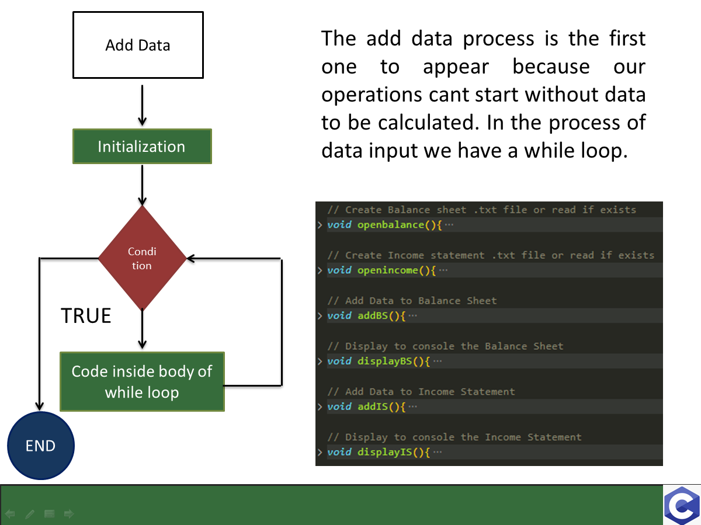
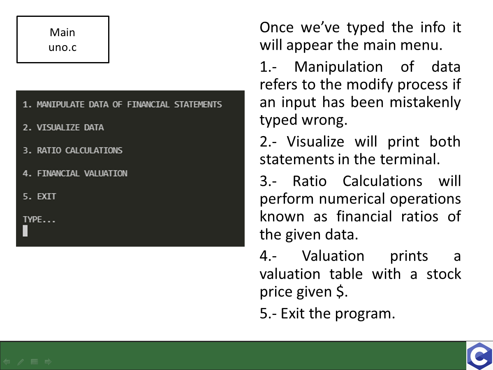
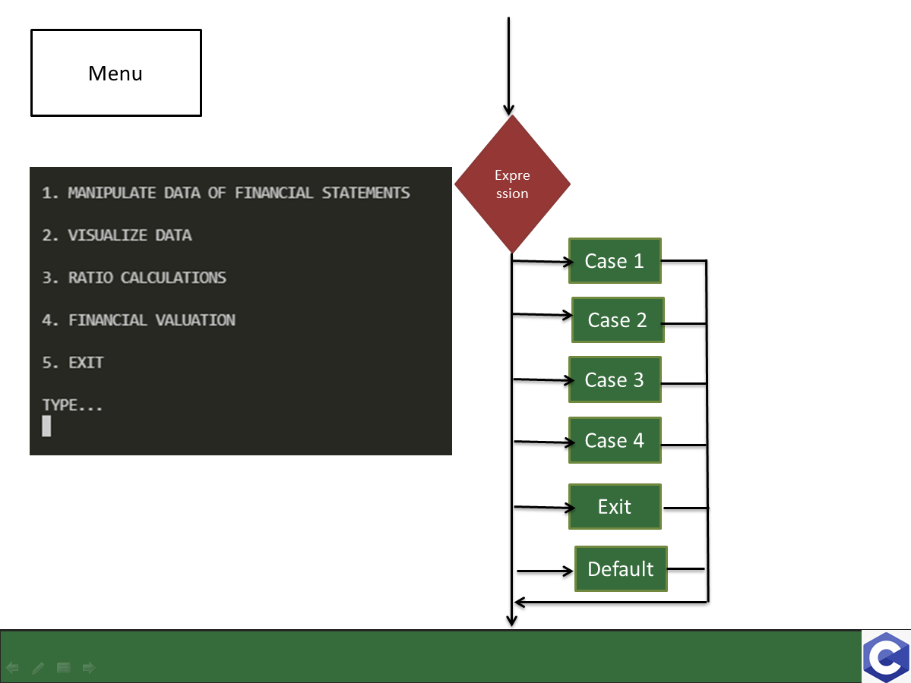
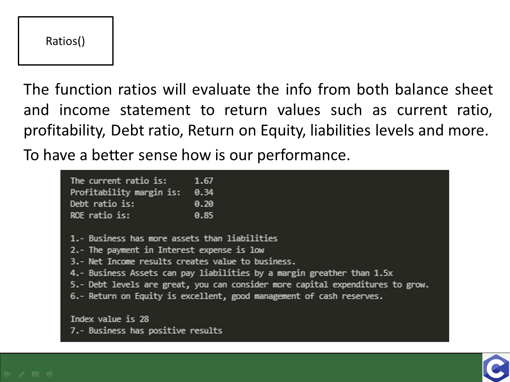
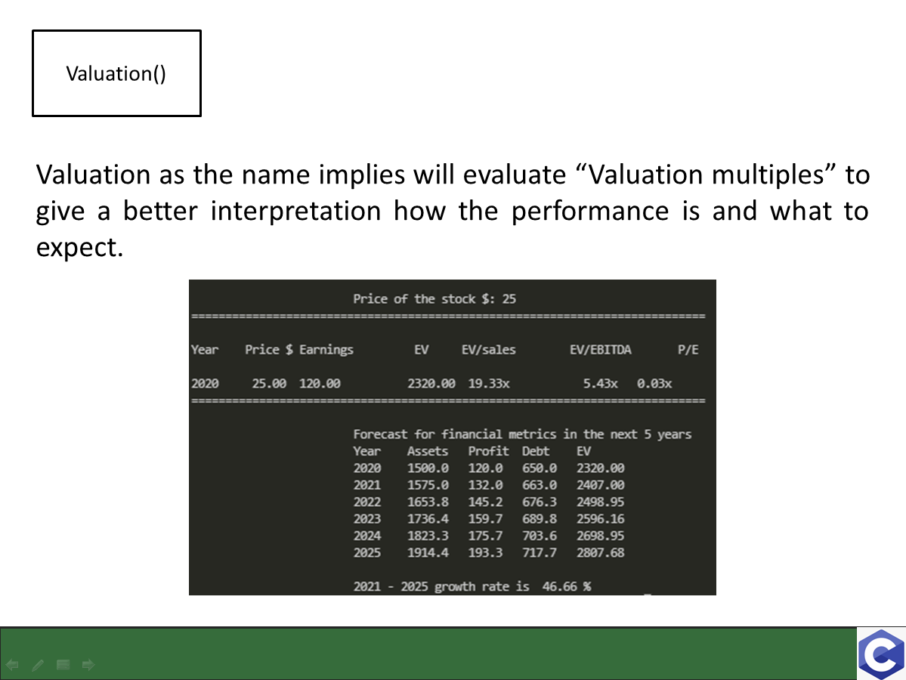
 

## Funcionalidad

Our main program first has an introduction. 

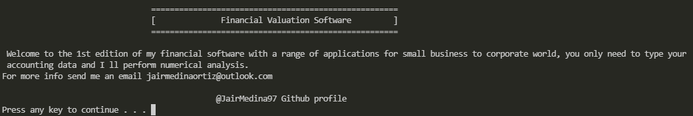
  
We'll use this financial data examples to have an input data.

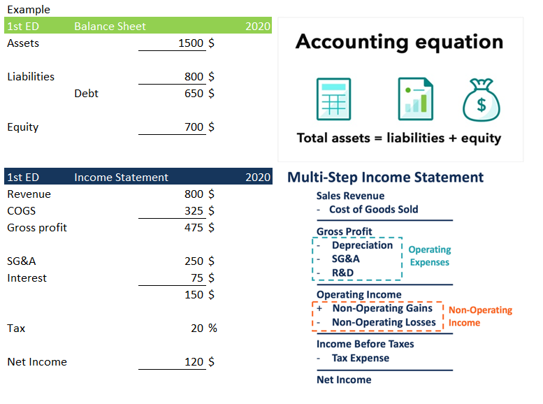  
  
We first need to upload the data into the Balance sheet. 

Then upload the data into the Income Statement. 

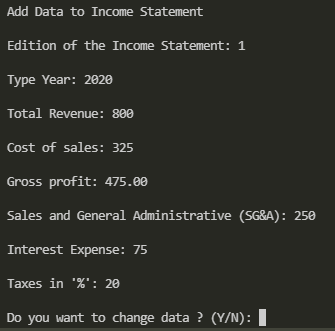

After the info has been updated we enter the menu section

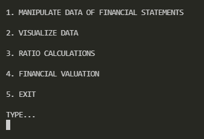
  
In option 1 we can modify, update our data. Manipulate is a function where we can modify our .txt files to overwrite the actual data with a new one if something has to be done different we have the option to upload a new entry.
  
We can display the financial statements in option 2. Two display functions one for each financial statement to print in a table format.

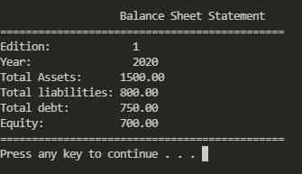

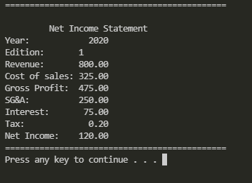
  
In option 3 we perform the logic structure of the conditional statements.The function ratios will evaluate the info from both balance sheet and income statement to return values such as current ratio, profitability, Debt ratio, Return on Equity, liabilities levels and more.
To have a better sense how is our performance.

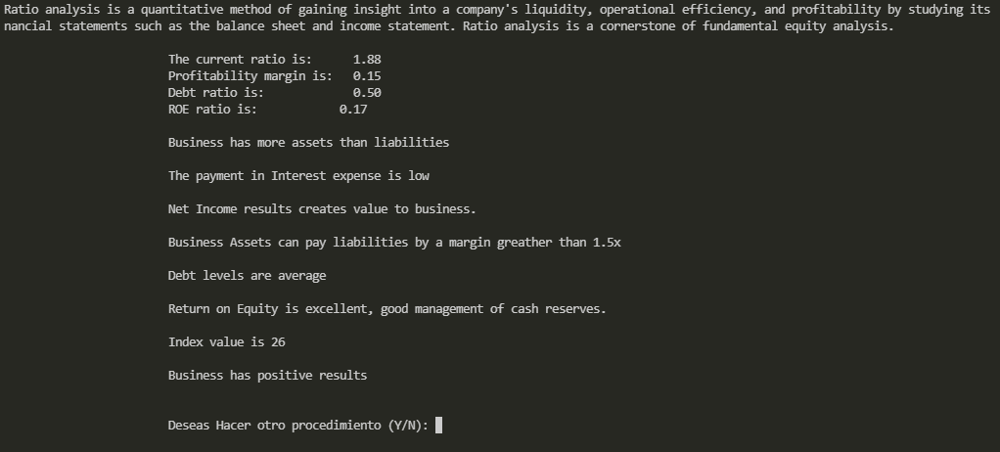
  
  
Logic of Financial ratios in C code:

<pre><code>    // LOGIC OF FINANCIAL RATIOS
    printf("\n\t\t\t%s", BS.assets > BS.liabilities ? "1.- Business has more assets than liabilities" : "1.- Business has more liabilities than assets");
    printf("\n\t\t\t%s", IS.profit < IS.interest ? "2.- The payment in Interest expense is large" : "2.- The payment in Interest expense is low");

    if (profitability >= 0.1){
        printf("\n\t\t\t3.- Net Income results creates value to business. ");
        index += index + 2;
    } else if (profitability >= 0 && profitability < 0.1){
        printf("\n\t\t\t3.- Profitability is low. ");  
        index += index + 0.5;   
    } else {
        printf("\n\t\t\t3.- The business is not profitable. ");
    }

    if (current > 1.5){
        printf("\n\t\t\t4.- Business Assets can pay liabilities by a margin greather than 1.5x");
        index += index + 2;
    } else if (current >= 0.75 && current <= 1.5){
        printf("\n\t\t\t4.- Assets have to pay Liabilities."); 
        index += index + 0.5;    
    } else {
        printf("\n\t\t\t4.- Liabilities are a great threat to business.");
    }

    if (leverage > 0.7){
        printf("\n\t\t\t5.- Your business has too much DEBT!");
    } else if (leverage >= 0.4 && leverage <= 0.7){
        printf("\n\t\t\t5.- Debt levels are average"); 
        index += index + 0.5;    
    } else {
        printf("\n\t\t\t5.- Debt levels are great, you can consider more capital expenditures to grow.");
        index += index + 1;
    }

    if(ROE >= 0.15 && (IS.profit >= 0 || BS.equity >= 0)){
        printf("\n\t\t\t6.- Return on Equity is excellent, good management of cash reserves.");
        index += index + 2;
    } else {
        printf("\n\t\t\t6.- Return on Equity is low, cash management is not properly invested.");       
    }

    printf("\n\n\t\t\tIndex value is %d\n", index);

    if(index >= 20){
        printf("\t\t\t7.- Business has positive results\n");
    } else if (index >= 12 && index<20){
        printf("\t\t\t7.- Business needs Due diligence\n");
    } else {
        printf("\t\t\t7.- Business may be in the need to declare BANKRUPTCY\n");
    }

    if(IS.profit <= 0 || BS.equity <= 0 ){
        printf("\t\t\t8.- The business is burning cash");
        index += index - 2;       
    }
</code></pre>
  
Option number 4 performs the valuation with a given stock price.Valuation as the name implies will evaluate “Valuation multiples” to give a better interpretation how the performance is and what to expect.

Method of Valuation in C code:

<pre><code> 
    PE = price / IS.revenue ; // Price to earnings multiple
    EV = BS.assets + BS.equity + IS.profit; // Enterprise Value
    EBITDA = IS.gross * 0.9; // Earnings Before Interest Depreciation & Amortization

    printf("============================================================================\n");
    printf("\nYear\tPrice $\tEarnings\t EV \tEV/sales\tEV/EBITDA\tP/E \n");
    printf("\n%d\t%6.2f\t%6.2f\t\t%6.2f\t%6.2fx\t\t%6.2fx\t%6.2fx\n", BS.year, price, IS.profit, EV, EV/IS.profit, EV/EBITDA, PE);
    printf("============================================================================\n");

    printf("\n\t\t\tForecast for financial metrics in the next 5 years");
    printf("\n\t\t\tYear\tAssets\t Profit\t Debt\t EV\n");

    printf("\t\t\t%d\t%6.1f\t%6.1f\t%6.1f\t %6.2f\n", BS.year, BS.assets, IS.profit, BS.debt, EV);
        for(i = 0; i < 5; i++){
            BS.year += 1;
            BS.assets = BS.assets * 1.05;
            IS.profit = IS.profit * 1.1;
            BS.debt = BS.debt * 1.02;
            EV = BS.assets + BS.equity + IS.profit;
            printf("\t\t\t%d\t%6.1f\t%6.1f\t%6.1f\t %6.2f\n", BS.year, BS.assets, IS.profit, BS.debt, EV);
        }
    printf("\n\t\t\t2021 - 2025 growth rate is %6.2f %%", (EV/BS.assets - 1) * 100 );
</code></pre>

## Video

La URL a [YouTube](https://youtube.com)

## Referencias

- <a id="1">[1]</a> Subramanyam, K. R. and Wild, John J. (2009) Financial statement analysis. 10th ed. Boston, Mass: McGraw-Hill Irwin. ISBN-10: 0073379433

- <a id="2">[2]</a> Corporate Finance Institute (2018) Financial Ratios eBook. 1st ed. Vancouver, CAN: CFI.
  
- <a id="3">[3]</a> Kernighan, B. W., & Ritchie, D. M. (1988). The C programming language. ISBN-13: 9780131103627
