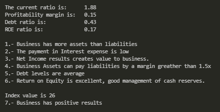

### Financial Valuation in C
#### Data analysis on Financial Statements :dollar:
Financial Statement analysis in C language of a given company
- Income statement & Balance Sheet analysis

The numerical analysis run in C can calculate financial ratios, run statistical analysis to perform valuations of small business or even a company listed on the stock exchange.

In finance, valuation is the process of determining the present value of an asset. Valuations can be done on assets or on liabilities.

Valuation guide
- Fundamental Analysis <a id="2">[1]</a>
- Ratio calculations <a id="2">[2]</a>
- Valuation
- Output

## Estructura
Here we can see the flow structure of the program. 

  

## Funcionalidad

Our main program first has an introduction. 

  
We'll use this financial data examples to have an input data.

  
  
We first need to upload the data into the Balance sheet. 

Then upload the data into the Income Statement. 

After the info has been updated we enter the menu section

  
In option 1 we can modify, update our data. Manipulate is a function where we can modify our .txt files to overwrite the actual data with a new one if something has to be done different we have the option to upload a new entry.
  
We can display the financial statements in option 2. Two display functions one for each financial statement to print in a table format.

  
In option 3 we perform the logic structure of the conditional statements.The function ratios will evaluate the info from both balance sheet and income statement to return values such as current ratio, profitability, Debt ratio, Return on Equity, liabilities levels and more.
To have a better sense how is our performance.

  
Option number 4 performs the valuation with a given stock price.Valuation as the name implies will evaluate “Valuation multiples” to give a better interpretation how the performance is and what to expect.

  

## Video

La URL a [YouTube](https://youtube.com)

## Referencias

- <a id="1">[1]</a> Subramanyam, K. R. and Wild, John J. (2009) Financial statement analysis. 10th ed. Boston, Mass: McGraw-Hill Irwin. ISBN-10: 0073379433

- <a id="2">[2]</a> Corporate Finance Institute (2018) Financial Ratios eBook. 1st ed. Vancouver, CAN: CFI.
  
- <a id="3">[3]</a> Kernighan, B. W., & Ritchie, D. M. (1988). The C programming language. ISBN-13: 9780131103627
