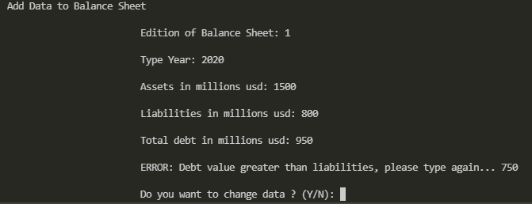
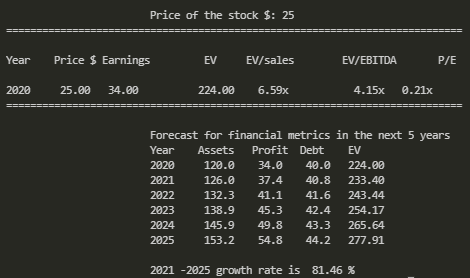

### Financial Valuation in C
#### Data analysis on Financial Statements :dollar:
Financial Statement analysis in C language of a given company
- Income statement, Balance Sheet & Cash flow calculations 

The numerical analysis run in C can calculate financial ratios, run statistical analysis to perform valuations of small business or even a company listed on the NYSE

In finance, valuation is the process of determining the present value of an asset. Valuations can be done on assets or on liabilities.

Valuation guide
- Fundamental Analysis
- Ratio calculations
- Valuation
- Output

[1]

## Estructura
Here we can see the flow structure of the program. 

## Funcionalidad

Our main program first has an introduction. 

  
We'll use this financial data examples to have an input data.

  
  
We first need to upload the data into the Balance sheet. 

Then upload the data into the Income Statement. 

After the info has been updated we enter the menu section

  
In option 1 we can modify, update our data 
  
We can display the financial statements in option 2.

  
In option 3 we perform the logic structure of the conditional statements.

  
Option number 4 performs the valuation with a given stock price.

  

## Video

La URL a [YouTube](https://youtube.com)

## Referencias

[1] Lo que cito arriba.
